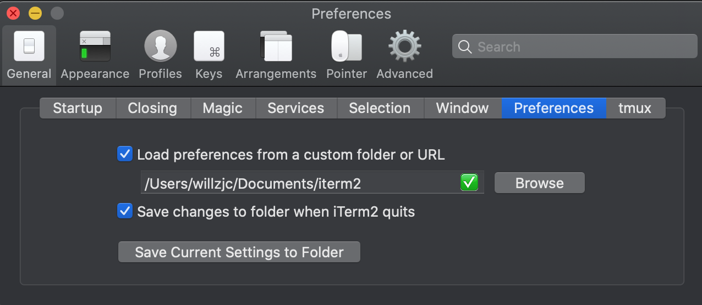

# iterm2_profile
iterm2 settings

## What is involved?
1. Keyboard bindings -> proper delete word, forward word, etc
2. .zshrc bindings and mappings

## Instructions
1. Copy files to a profile folder of your choice
!(doc/pref.png)[doc/pref.png]

2. copy .zshrc to base $HOME directory
